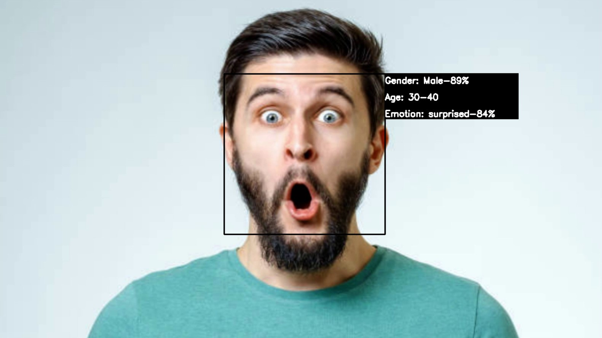
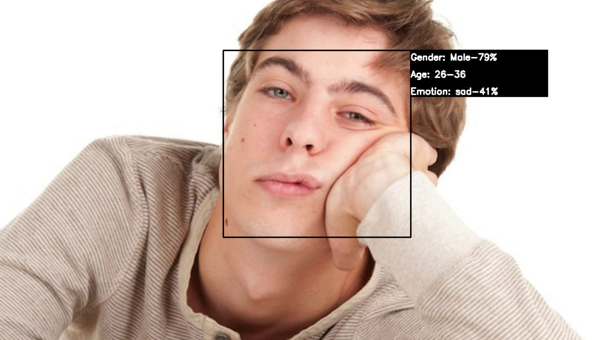
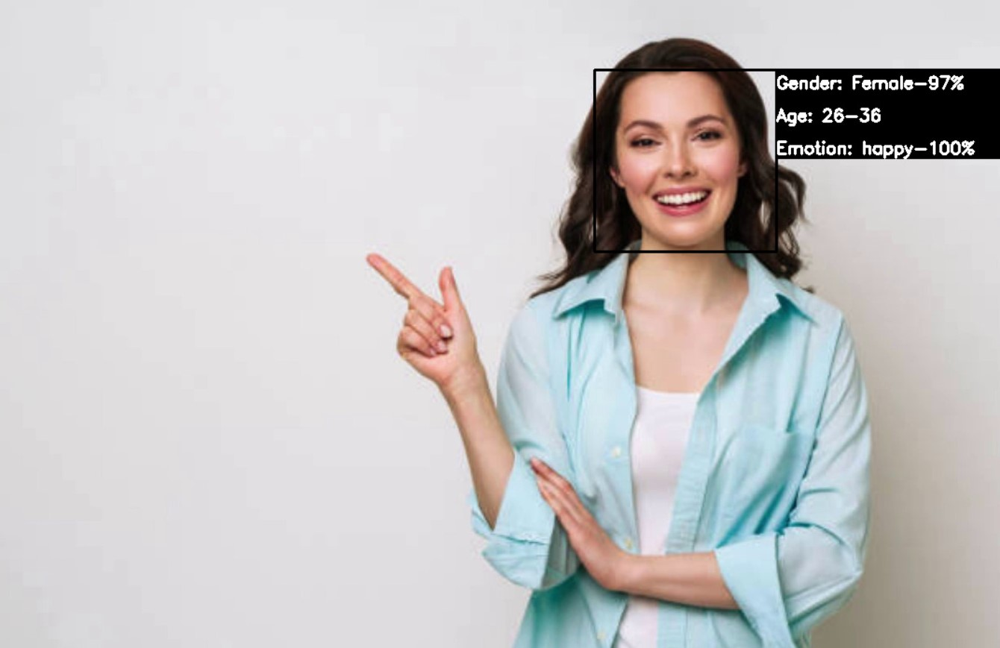
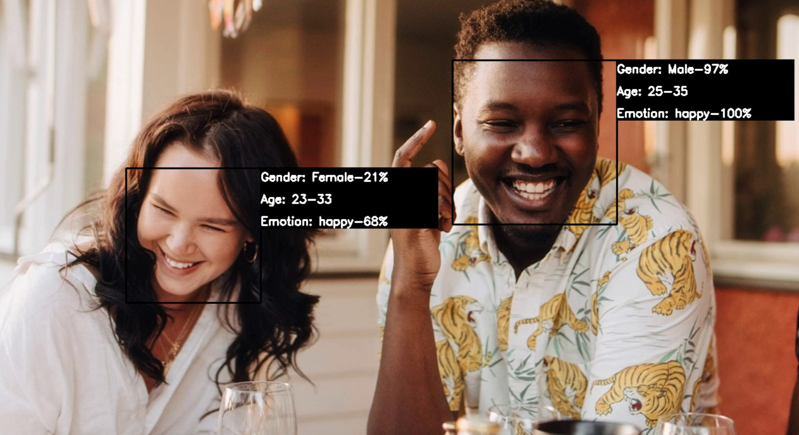

<h1 align="center">Recognition: Gender👫 - Age👶🧓  Emotion😁😲😨😠😢</h1>

------------------------------------------
## Pytorch: Gender Age and Emotion 
### Dependencies

* Mediapipe
* Opencv
* Numpy
* Python3
* Pytorch

```python
pip install mediapipe    # mediapipe library
pip install opencv       # opencv library
pip instal numpy         # numpy library
pip instal pytorch       # pytorch library
pip install torchsummary # summary
pip install torchvision  # pytorch for vision
```

=

### How to run
Run the following **scripts** for training and/or testing

```python
python train.py # For training the model 
```

### Sample outputs

Recognition results







---------------------------------------------

### Todo

1. Experiments with different **learning-rate and optimizers**.
2. **Converting and optimizing** pytorch models for **mobile** deployment.

### Authors

Van Thiep
